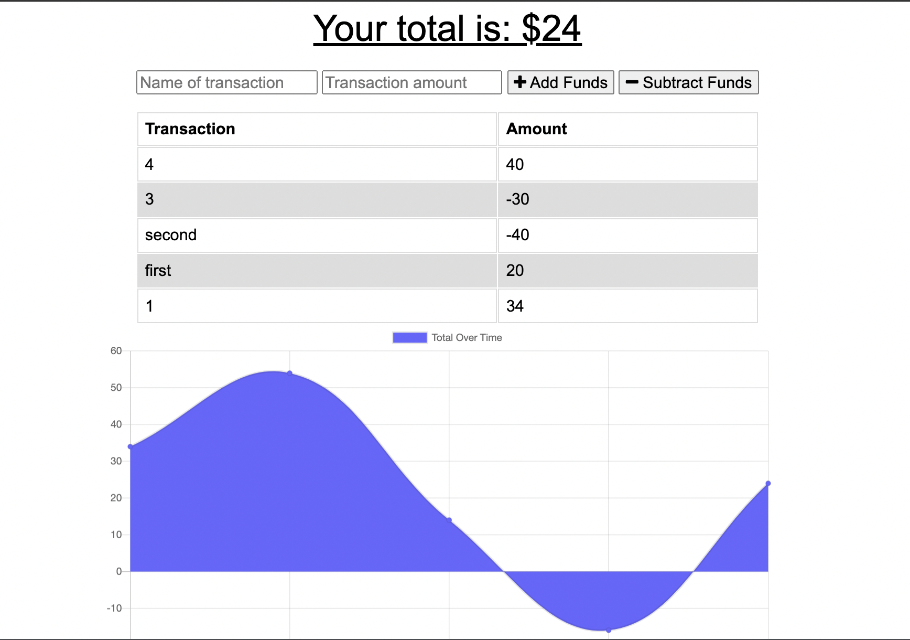

# C19-Budget-Tracker

## Description

    This project was about using IndexedDB, Mongoose, and Express.js to provide offline functionality to an existing program. In particular, the application had to be able to allow user access when lacking internet connectivity, store their input, and then finish processing the request when the connection was re-established.

## Experience Gained

   I found this particular assignment somewhat confusing initially, but once I looked through the in-class assignments and formulated the code with that information, the challenge went a bit smoother. The most difficult piece was getting the tiny bugs worked out of the relatively dense code. The various fetch requests through several errors until I walked backwards from the end, piece by piece, and slowly analyzed each line until I worked out all of the bugs. I found this method of storing user input much easier than using the localstorage web API.

## GitHub Links (Repository and Demo Video)

    The repository link: https://github.com/ekball/C19-Budget-Tracker

    The deployed site: https://warm-woodland-59583.herokuapp.com/

## Demo Social Network

